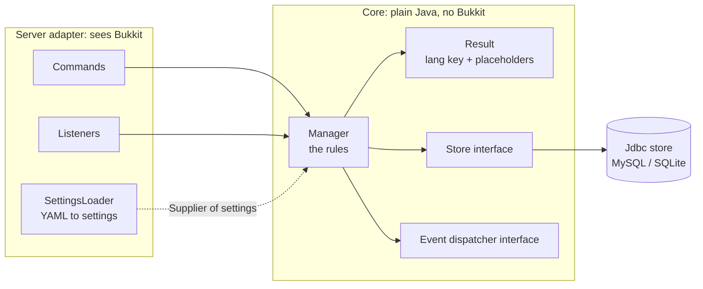
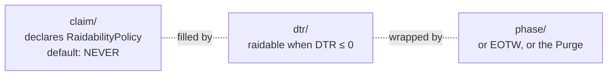

# Architecture overview

A short tour of how HCFCore is built. The full design document, with the reasoning behind every rule, is [`ARCHITECTURE.md`](https://github.com/Lawkeys-dev/hcf-core/blob/main/ARCHITECTURE.md).

## One module per system

Each system — `team`, `claim`, `dtr`, `pvp`, `economy`, `events`, `resourcenode`, `phase`, `staff`, `kit`... — is a package of its own under `com.lawkeys.hcfcore`, with its own configuration file, its own tables and its own migrations. Each can be switched off in its file without breaking the others.

## A pure core behind a thin adapter

Every module is split in two:

- **The core** — the manager, its model, its storage and its migrations — has **no Bukkit import**. It receives its settings as a `Supplier` (so `/hcf reload` swaps them), its storage and events as interfaces, and even its clock, so every rule is unit-tested without a server and expiry logic is tested without waiting.
- **The adapter** — the module class, commands and listeners — is the only layer that sees Bukkit. It parses input, calls the manager, and turns the answer (a language key and placeholders) into a message. Game logic in a command or a listener is structurally impossible: the adapter has no access to the internal state.

## Memory is the source of truth

Each manager keeps its data in a `ConcurrentHashMap`, loaded at startup. An action changes memory at once — the game never waits on the database — and the change is written in the background, periodically and in full on shutdown. Nothing touches a cache before it is loaded: a startup barrier keeps players out until every load has succeeded, and for good if one fails.

## Seams between modules

When a module needs an answer only a later module holds — *is this team raidable?* — it declares an **interface with a safe default**, and the later module fills it at startup:

The dependency never points back (`claim/` never knows `dtr/`), every default is a complete behaviour rather than a `null`, and modules can be built and tested in any order. When a module only needs to *react*, it listens to a public event instead. The full table of seams, with who fills each one, is in [ARCHITECTURE.md section 14](https://github.com/Lawkeys-dev/hcf-core/blob/main/ARCHITECTURE.md#14-coupling-between-modules-seams-not-direct-calls).

## Two families of events

KOTH, Citadel, Conquest, Kill the King, DTC, Last Break, Slide and Totem (things to capture or win) and Mountains (things that refill) share **no abstraction** — only a box type and a clock. Players still see one agenda: Mountains *contribute* their lines to `/events` through a seam, rather than the event module learning what a refill is.

## Configuration everywhere

Every gameplay value is a setting, every player-facing text is a key in `lang/en.yml`, and every value that is a balance decision ships empty or neutral. An invalid value is reported and replaced by its default — it never takes the server down.

## Dependencies are optional

Vault, LuckPerms and Apollo are soft dependencies: each is used only if its plugin is present, and the plugin works fully without any of them. Holograms use Paper's own text displays, and the scoreboard Paper's own API — no library to shade.
