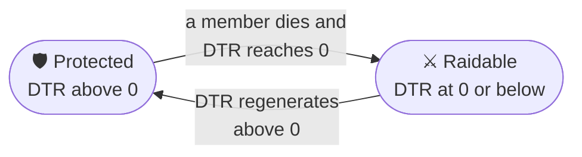

# DTR and raids

*Configured in [`dtr.yml`](../reference/configuration/dtr.md). Command: `/team dtr [team]`.*

A team's **DTR** — *Deaths Till Raidable* — is how many more deaths it can take before its land opens. It is what makes a base worth defending and a fight worth taking.

## The scale

| | Default | Setting |
|---|---|---|
| Maximum | **1.1 per member**, capped at **6.6** (six members' worth) | `maximum.per-member`, `maximum.cap`, `maximum.base` |
| Cost of a death | **1.0** | `loss-per-death` |
| Floor | **−5.0** | `minimum` |
| Regeneration | frozen **45 minutes** after a death, then **+0.1 every 3 minutes** | `regeneration.*` |

**At 0 or below, the team is raidable.**

A solo team holds 1.1, so its first death leaves it at 0.1 — still protected — and the second one opens it. That asymmetry is the classic HCF scale. A deeper floor means a heavily farmed team takes proportionally longer to close its base.

## The raid cycle



- **While raidable**, anyone but the team's allies can build, break and open things in its land, and explosions go through: the *pillage window*.
- **The land never changes hands.** No team can claim a raidable team's land; the raid gives access to what is inside, never to the ground.
- **Protection comes back by itself** the moment the DTR climbs back above zero, with the claim intact.

EOTW and the Purge make every team raidable whatever its DTR — see [Map phases](map-phases.md).

## Regeneration

After a death, regeneration is **frozen for 45 minutes** (`freeze-seconds`) — long enough for a raid to happen — then gives **0.1 every 3 minutes**: a full point every half hour.

It is **stepwise, not continuous**: a partial interval gives nothing, so what players see matches what the server announces.

!!! info "DTR is worked out from time, not ticked"
    What is stored is the value at the last death and the instant regeneration resumes; the current figure is computed whenever it is read. Nothing drifts when the server lags, and **regeneration keeps running while the server is down**: a team that logs off raidable can come back protected. That is the usual HCF behaviour.

## Seeing it

- `/team dtr [team]` — the value, the maximum, the freeze left, and how long until protection returns.
- `/team here` — whether the land you stand on is protected or raidable.
- The scoreboard — `%dtr%`, `%dtr_coloured%` (dark red with "(raidable)" when open) and `%dtr_max%`.
- Lunar Client nametags show each player's team and DTR.

## Announcements

- The team is told how much DTR a member's death cost (`announcements.on-death`).
- **Becoming raidable is announced to the whole server at once** — a death causes it.
- **Becoming protected again is announced at the next check**, every 60 seconds (`poll-seconds`). The poll only drives the announcement: the protection itself comes back on time, whatever this value.

## Staff overrides

```text
/team setdtr Vikings 3.3        # set a team's DTR
/team setregen Vikings 0        # regeneration resumes now
```

`setdtr` does not restart the freeze: staff raising DTR to close a raid do not restart a 45-minute counter. Both need `hcfcore.team.admin`.

## Switching DTR off

`enabled: false` means no team is ever raidable: claims stay permanently protected, and deaths cost nothing. `regeneration.amount: 0` keeps DTR but stops regeneration — a team then recovers only through a staff override.

## Points

A team whose DTR makes it raidable **loses half its [points](teams.md#points-and-ranking)** (`teams.yml`, `points.raidable-loss-percent`, `50`), or a fixed number with the share at `0` (`points.per-raidable`).

## For developers

`TeamRaidableEvent` fires when a team's DTR makes it raidable, or no longer. It reports the DTR, not the map: EOTW and the Purge fire nothing. See the [Developer API](../developers/api.md#teamraidableevent).
