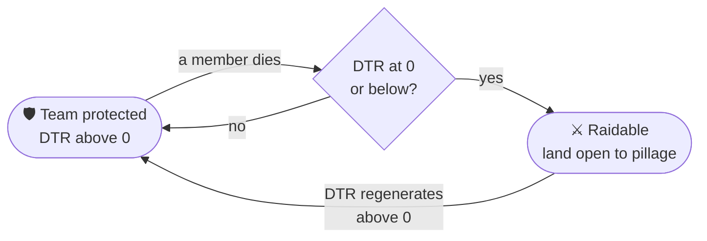

# How the game works

What each rule does, with the values it ships with. **Every number on these pages is a setting**; the file that holds it is named at the top of each page, and `/hcf reload` applies a change.

## HCF in one minute

**Hardcore Factions** is a team PvP game on a bounded map that resets every few weeks.

1. Players form **teams** and **claim** land around a base. Inside it, nobody else can build, break or open anything.
2. Every team has a **DTR** — *Deaths Till Raidable* — that each member's death lowers. When it runs out, the team is **raidable**: its land is open to **pillage** until its DTR regenerates. The land itself never changes hands.
3. A death **bans** the player for a while (a *deathban*), so every fight matters. Logging out in combat kills you.
4. **Events** — KOTH, Conquest, Kill the King, Mountains — pull teams into the open to fight for rewards and points.
5. The map opens with **SOTW** (no PvP while everyone settles) and ends with **EOTW** (everyone raidable, a death bans until the reset).

**Kitmap** is the fast variant: kits from signs at spawn, usually no deathbans, killstreak rewards. The same plugin runs both — see [Game modes](../getting-started/game-modes.md).

## The rules, system by system

-   :material-account-group: [__Teams__](teams.md) — roles, invitations, alliances, focus, rally, bank, points and chat
-   :material-map-marker-radius: [__Territory__](territory.md) — claims, protection, HQ, stuck, lock, server land and the warzone
-   :material-shield-half-full: [__DTR and raids__](dtr-and-raids.md) — how many deaths a team takes, regeneration, the raid cycle
-   :material-sword: [__Combat__](combat.md) — combat tag, combat logging, safe zones, friendly fire, loot protection
-   :material-skull: [__Deathbans and lives__](deathbans-and-lives.md) — ban length, rank tiers, lives and revives
-   :material-calendar-clock: [__SOTW, EOTW and the Purge__](map-phases.md) — opening, closing and purging the map
-   :material-flag-variant: [__Capture events__](events.md) — KOTH, Citadel, Conquest, Kill the King
-   :material-image-filter-hdr: [__Mountains__](mountains.md) — regions that refill on a clock
-   :material-cash: [__Economy__](economy.md) — balances, `/pay`, team banks, Vault
-   :material-bag-personal: [__Kits and abilities__](kits.md) — kits, refill signs, layouts, partner items, killstreaks
-   :material-auto-fix: [__Enchants, limits and the crowbar__](items.md) — custom enchants, enchantment and potion caps, block limits
-   :material-monitor-dashboard: [__Chat, scoreboard and settings__](interface.md) — chat format, scoreboard, tab list, stats, settings

## Which rule wins

A few systems answer the same question — *may this player build here? may they hit that one?* — and the plugin settles them in a fixed order:

- **Building**, from most to least specific: land claimed by a team follows that team's rules; on unclaimed land, a Mountain's region follows the Mountain's rules; the rest of the warzone follows the warzone's; beyond it is the wilderness, where anything goes.
- **Hitting**: a hit is refused on a safe zone, during SOTW (unless both players typed `/sotw enable`), between teammates, and between allies outside an event area. **A refused hit tags nobody.** What a player may not hit, they may not affect either — no harmful splash potion, fishing rod pull or wind charge push.
- **Raidable**: a team is raidable while its DTR is at 0 or below, **or** while EOTW or the Purge runs.
